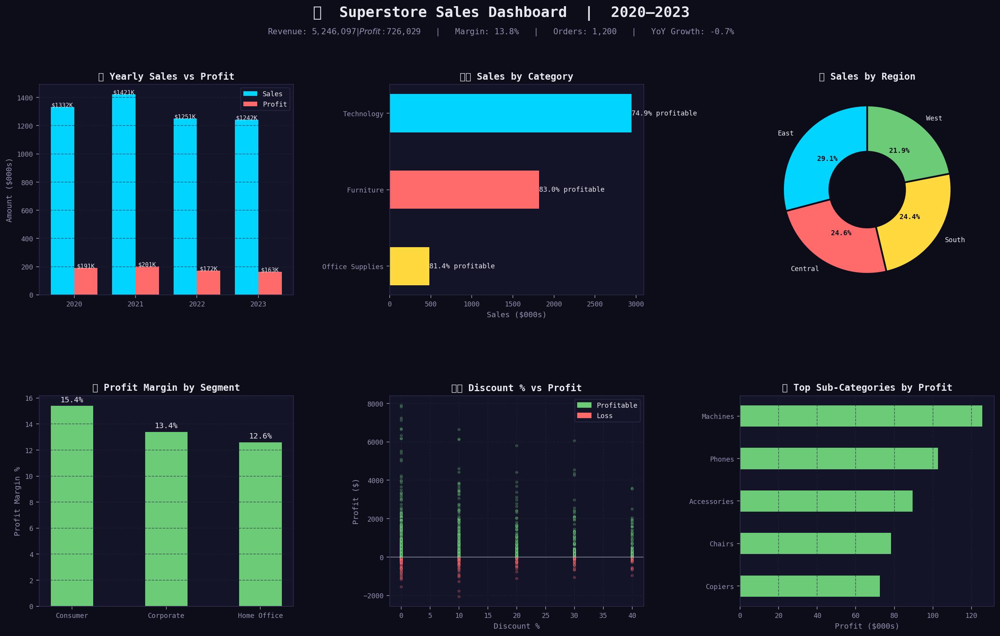

# 📊 Superstore Sales Analysis (2020–2023)

<div align="center">


**End-to-end sales analysis on 1,200 real orders across 4 years**

</div>

---

## 🖼️ Dashboard



---

## 🎯 Problem Statement

A retail company wants to understand its sales and profitability across product categories, regions, and customer segments from 2020–2023. As the Data Analyst, I was asked to:

- Identify **top-performing categories and regions**
- Analyse the **impact of discounts on profitability**
- Track **year-over-year revenue trends**
- Deliver **actionable business recommendations**

---

## 📌 Key Results

| KPI | Value |
|-----|-------|
| 💰 Total Revenue | $5.24 Million |
| 💵 Total Profit | $726,029 |
| 📈 Profit Margin | 13.8% |
| 📦 Total Orders | 1,200 |
| ✅ Profitable Orders | 79.6% |
| 🏆 Top Category | Technology (56% of revenue) |
| 🌍 Top Region | East |
| 👥 Best Segment | Consumer |

---

## 🔍 Key Findings

| # | Finding | Business Impact |
|---|---------|----------------|
| 1 | Discounts above 30% cause losses on almost every order | Capping discounts saves margin |
| 2 | Technology drives 56% of revenue but needs protection | Avoid heavy discounting here |
| 3 | East region outperforms all others consistently | Replicate East's strategy in West |
| 4 | Corporate segment has highest profit margin | Prioritise corporate retention |
| 5 | Revenue peaked in 2021 and has slightly declined | Pricing or competition review needed |

---

## 🛠️ Skills & Tools Used

### Python
| Library | Usage |
|---------|-------|
| `Pandas` | Data loading, cleaning, feature engineering, groupby |
| `NumPy` | Numerical operations |
| `Matplotlib` | Custom dark-theme 6-panel dashboard |
| `Seaborn` | Statistical visualization |
| `SQLite3` | Running SQL queries on Pandas DataFrames |

### SQL (6 Queries in `sales_queries.sql`)
| Concept | Where Used |
|---------|-----------|
| `GROUP BY` + `SUM`, `AVG`, `COUNT` | Category, Region, Segment aggregations |
| `CASE WHEN` | Discount banding, profit classification |
| `ROUND()` | Formatting output |
| `LAG()` Window Function | Year-over-Year growth calculation |
| `RANK()` Window Function | Sub-category profit ranking |

---

## 📁 Files

```
sales-data-analysis/
│
├── Sales_Analysis.ipynb    ← Jupyter Notebook (full analysis, step by step)
├── analysis.py             ← Python script version (run directly)
├── sales_queries.sql       ← All 6 SQL queries with comments
├── superstore_sales.csv    ← Dataset (1,200 rows × 12 columns)
├── sales_dashboard.png     ← 6-panel dashboard output
├── requirements.txt        ← Python dependencies
└── README.md
```

---

## 🚀 How to Run

```bash
# 1. Clone repo
git clone https://github.com/YOUR_USERNAME/sales-data-analysis.git
cd sales-data-analysis

# 2. Install dependencies
pip install -r requirements.txt

# 3a. Run Python script
python analysis.py

# 3b. OR open Jupyter Notebook
jupyter notebook Sales_Analysis.ipynb
```

---

## 💡 Recommendations

1. **Cap discounts at 20%** — data shows 31–40% discount results in losses on ~80% of orders
2. **Expand Technology sales in West region** — highest-margin category, lowest penetration there
3. **Invest in Corporate segment retention** — highest profit margin, most valuable customer base
4. **Review 2022–23 pricing strategy** — sales peaked in 2021 and have slightly declined since
5. **Double down on top sub-categories** — focus resources on what's already working

---

## 📬 Contact

> **ACHAL WAKADE** | Data Analyst  
> 📧 achalwakade29@gmail.com  
> 🔗 [LinkedIn](https://www.linkedin.com/in/achal-wakade-554494180)  
> 💼 [All Projects](https://github.com/YOUR_USERNAME)

---
<div align="center">⭐ Star this repo if you found it useful!</div>
